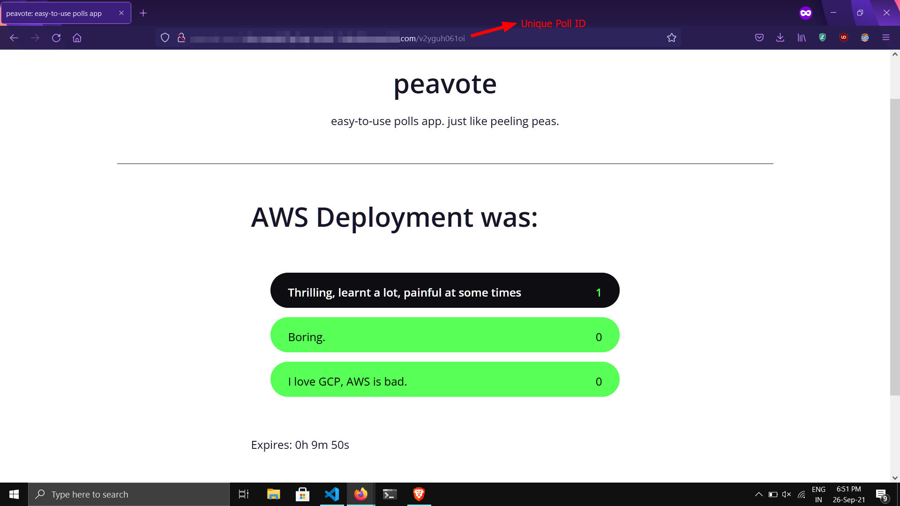
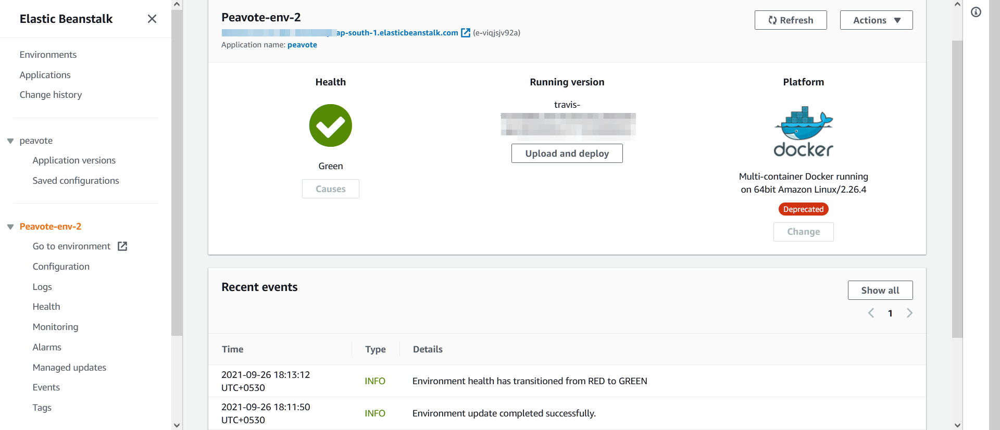

# peavote

Easy-to-use polls website.

**Preview after being deployed to AWS Elastic Beanstalk:**

**Elastic Beanstalk Dashboard after deployment:**

## What's being used:
- Frontend
  - React
  - [aura.css](https://burntcarrot.github.io/aura.css)
- Backend
  - Express
  - Sequelize
  - Helmet
- Deployment
  - Docker
  - Docker Compose
  - Nginx
  - Travis CI
  - Docker Hub
  - AWS
    - AWS Elastic Beanstalk
    - AWS RDS (PostgreSQL)
    - AWS S3

## Development Architecture:

## Deployment Architecture:

Brief summary:
- Deployed on **AWS Elastic Beanstalk** with **AWS S3** Buckets for storing **Travis CI** builds.
- Beanstalk is configured with a **AWS RDS PostgreSQL** instance running in Free Tier (*db.t2.micro* instance).

## FAQ:

- **Why not a Kubernetes deployment?**
  - I actually wanted to deploy it through **GCP** using Kubernetes (GKE), however, my local Kubernetes environment had lots of issues (failed pod deployments, etc.) as I was using **Kompose** for converting my Docker-Compose deployment to a Kubernetes-based deployment. I eventually found out that AWS has **Elastic Beanstalk**, which is a much better solution for Docker-Compose based deployments, and hence, I deployed my application on Elastic Beanstalk.
- **Why didn't you use PostgreSQL as a Docker image in your Elastic Beanstalk deployment?**
  - I opted for AWS RDS as it easily manages backups, failovers and replications. It is also a bad practice for using Docker for storing persistent data.
- **Is Kubernetes really required?**
  - My answer would be **no**. Kubernetes is good, and I definitely would love to deploy my apps using it if I were to start from scratch, but honestly, AWS scales really well, so I'm not yet fully convinced for shifting to Kubernetes.

